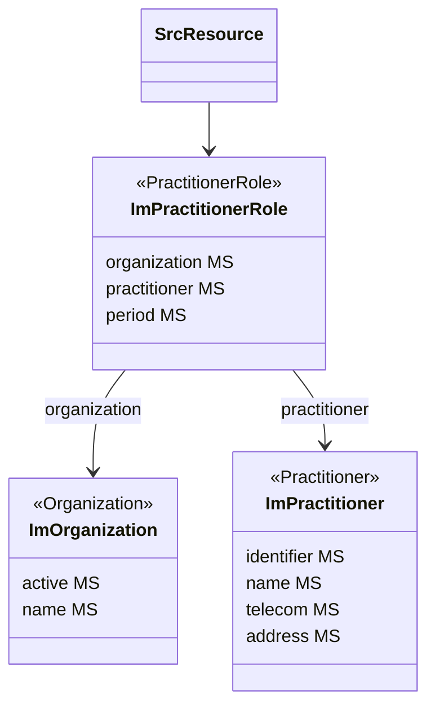

### Representing Healthcare Proffessionals

When referring to healthcare professionals, the {{ehnImagingGuidelines}} include information on the professional as well as on the organization the professional is associated with (e.g. information recipient, author, resultValidator, etc.). In FHIR a healthcare professional is represented as a `Practitioner`. As a healthcare professional can be employed by multiple organizations, a different resource,`PractitionerRole` models the relationship between the healthcare professional and an organization.

The source resource (SrcResource) will always point to `ImPractitionerRole` when referring to a healthcare professional. The `ImPractitionerRole` requires support for the `organization` and `practitioner` fields.

On `ImPractitioner` and `ImOrganization` the fields present to identify the healthcare professional are labeled as must support.

**OPEN ISSUE:** Are there requirements related to ImOrganization.period?
