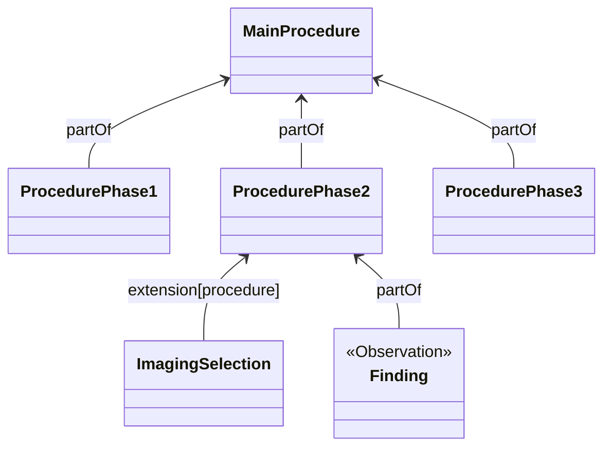
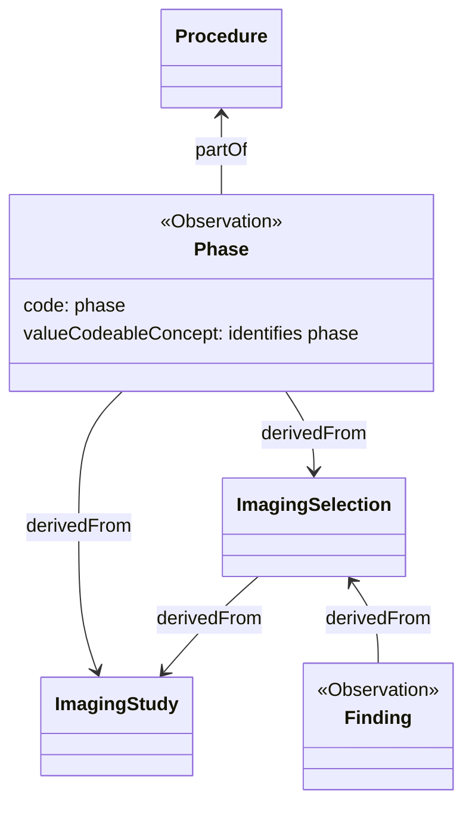
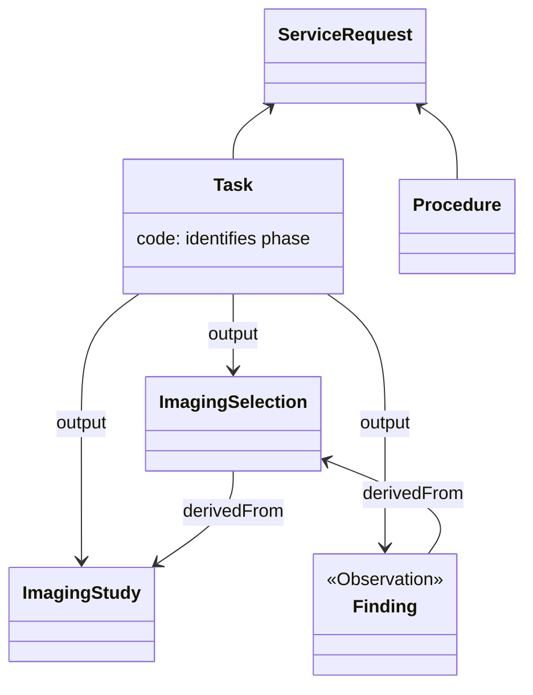
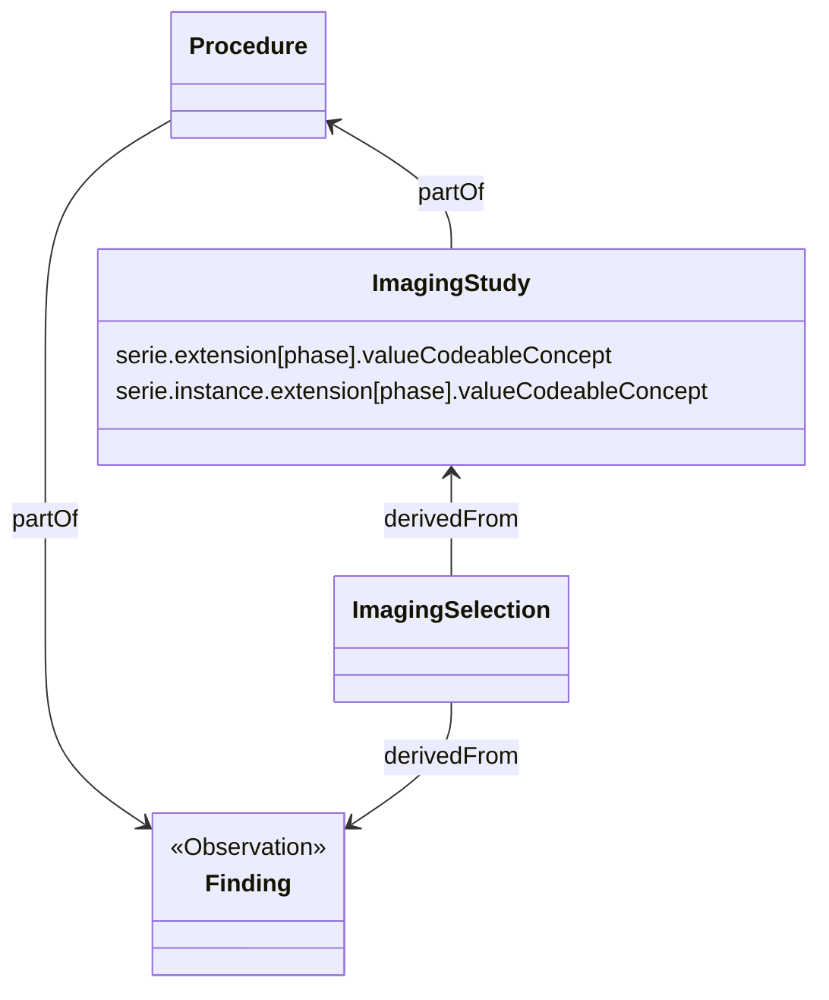
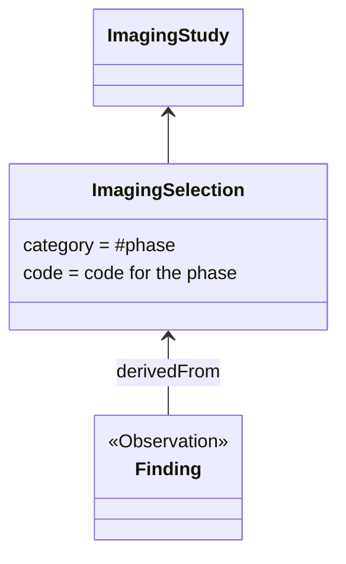

### Procedure Phases

Dataset A5.1.9 relates to the inclusion of additional procedure details. The description states: _"Additional information pertaining imaging procedure, such as imaging phase. e.g., without contrast, arterial phase, venous phase, delayed phase. Only some types of studies have phases."_

The imaging phase relates to certain studies such and radiation therapy and nuclear medicine. These procedures go through different phases, typically a phase represents a time frame after a tracer has been provided to the patient (e.g. [Abdominal CT: Urogram](https://litfl.com/abdominal-ct-urogram/)).

Just stating that the procedure included these phases does not seam to add a lot of value. The added value is linking results from the procedure to each stage.

These results include imaging series and instances and possibly findings.

#### Leave it in DICOM

Do not include this information in FHIR and the healthcare professional has to look at the DICOM image in order to detect the phase.

Findings (`Observations`) are linked to an `ImagingSelection` the phase is derived from the code.

#### Use child procedures

One way of modelling such a procedure would be to use child procedures.

Each phase is represented by a separate Procedure. The results of each phase will be point to the sub-procedure.

This will work for findings (`Observations`), it is slightly more cumbersome for DICOM series and instances as these are hosted in the ImagingStudy resource and not as a separate resource. One way of referring to each serie or instance is to use `ImagingSelection`. In that approach, an `Extension` on `ImagingSelection` will point to the corresponding sub-procedure.

Findings point to the sub-procedure representing the phase. This model introduces a large set of additional resource and references,including requirements on timing, not sure whether this is justified for this information.

#### Observations mark results of a phase

The phase is represented as an Observation.

An observation is created for each phase, the `code` states it represents a phase, the `partOf` field points to `Procedure`, and `derivedFrom` to `ImagingStudy` and `ImagingSelection`, the `valueCodeableConcept` identifier what phase it is.

Findings point to the `ImagingSelection` representing the part of the study they relate to. The phase can be deducted through the link from the Phase Observation. Alternatively, it could be encoded in the `Finding.code` as well.

This will work from but using Observation to observe a phase in an procedure is somewhat awkward.

#### Represent a phase as a Task

The procedure phase could also be represented as a `Task`, documenting that results of the phase.

The task is modelled as part of the execution of a `ServiceRequest`. The `output` field in the `Task` points to the `ImagingSelection` that represents the instance or serie that is the result of the phase.

Findings link to the phase `Task` and `ImagingSelection`.

This approach does not link the phase to the `Procedure` but the `ServiceRequest` (order).

#### Add an extension on ImagingSelection

Another way encode such information would be to add an extension to `ImagingStudy`, `ImagingStudy.serie` and `ImagingStudy.serie.instance` that states the phase this part of the study was retrieved in as a coded value.

#### Using ImagingSelection to represent a Phase

An `ImagingSelection` resource is used to represent the results of the study from a phase. `ImagingSelection.category` will be used to mark it as a phase. The `ImagingSelection.code` will mark the phase it represents.

Findings will point to the `ImagingSelection` as normal.

#### Evaluation

Although the different options all make sense in some way. The last option has the smallest impact on the model and does not require additional extensions.

**CHOICE:** Procedure phases will be represented as `ImagingSelections`.
