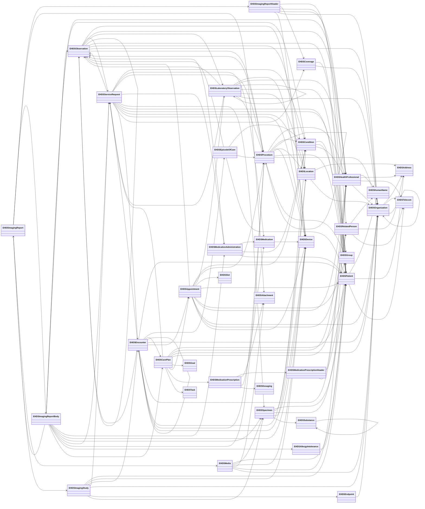

```mermaid
classDiagram
direction LR
EHDSImagingReport --> EHDSImagingReportHeader 
EHDSImagingReport --> EHDSImagingReportBody 
EHDSImagingReport --> EHDSAttachment 
EHDSImagingReport --> EHDSMedia 
EHDSImagingReport --> EHDSImagingStudy 
EHDSImagingReportHeader --> EHDSPatient 
EHDSImagingReportHeader --> EHDSCoverage 
EHDSImagingReportHeader --> EHDSRelatedPerson 
EHDSImagingReportHeader --> EHDSHealthProfessional 
EHDSImagingReportHeader --> EHDSOrganization 
EHDSImagingReportHeader --> EHDSDevice 
EHDSPatient --> EHDSHumanName 
EHDSPatient --> EHDSAddress 
EHDSPatient --> EHDSTelecom 
EHDSCoverage --> EHDSPatient 
EHDSCoverage --> EHDSOrganization 
EHDSOrganization --> EHDSAddress 
EHDSOrganization --> EHDSTelecom 
EHDSOrganization --> EHDSOrganization 
EHDSRelatedPerson --> EHDSHumanName 
EHDSRelatedPerson --> EHDSAddress 
EHDSRelatedPerson --> EHDSTelecom 
EHDSHealthProfessional --> EHDSHumanName 
EHDSHealthProfessional --> EHDSAddress 
EHDSHealthProfessional --> EHDSTelecom 
EHDSHealthProfessional --> EHDSOrganization 
EHDSImagingReportBody --> EHDSHealthProfessional 
EHDSImagingReportBody --> EHDSCondition 
EHDSImagingReportBody --> EHDSObservation 
EHDSImagingReportBody --> EHDSMedicationAdministration 
EHDSImagingReportBody --> EHDSDevice 
EHDSImagingReportBody --> EHDSSpecimen 
EHDSImagingReportBody --> EHDSServiceRequest 
EHDSImagingReportBody --> EHDSProcedure 
EHDSImagingReportBody --> EHDSAllergyIntolerance 
EHDSImagingReportBody --> EHDSCarePlan 
EHDSImagingReportBody --> EHDSImagingReport 
EHDSCondition --> EHDSPatient 
EHDSCondition --> EHDSGroup 
EHDSCondition --> EHDSHealthProfessional 
EHDSObservation --> EHDSDevice 
EHDSObservation --> EHDSServiceRequest 
EHDSObservation --> EHDSHealthProfessional 
EHDSObservation --> EHDSLaboratoryObservation 
EHDSObservation --> EHDSObservation 
EHDSObservation --> EHDSPatient 
EHDSObservation --> EHDSLocation 
EHDSObservation --> EHDSOrganization 
EHDSObservation --> EHDSProcedure 
EHDSServiceRequest --> EHDSObservation 
EHDSServiceRequest --> EHDSCondition 
EHDSServiceRequest --> EHDSMedication 
EHDSServiceRequest --> EHDSProcedure 
EHDSServiceRequest --> EHDSMedicationAdministration 
EHDSServiceRequest --> EHDSSpecimen 
EHDSServiceRequest --> EHDSPatient 
EHDSServiceRequest --> EHDSGroup 
EHDSServiceRequest --> EHDSLocation 
EHDSServiceRequest --> EHDSDevice 
EHDSServiceRequest --> EHDSEncounter 
EHDSServiceRequest --> EHDSCoverage 
EHDSMedication --> EHDSDevice 
EHDSProcedure --> EHDSHealthProfessional 
EHDSProcedure --> EHDSCondition 
EHDSProcedure --> EHDSObservation 
EHDSProcedure --> EHDSProcedure 
EHDSProcedure --> EHDSDevice 
EHDSProcedure --> EHDSLocation 
EHDSProcedure --> EHDSPatient 
EHDSProcedure --> EHDSOrganization 
EHDSProcedure --> EHDSGroup 
EHDSLocation --> EHDSAddress 
EHDSLocation --> EHDSOrganization 
EHDSMedicationAdministration --> EHDSMedication 
EHDSMedicationAdministration --> EHDSCondition 
EHDSMedicationAdministration --> EHDSObservation 
EHDSMedicationAdministration --> EHDSPatient 
EHDSSpecimen --> EHDSPatient 
EHDSSpecimen --> EHDSLocation 
EHDSSpecimen --> EHDSGroup 
EHDSSpecimen --> EHDSDevice 
EHDSSpecimen --> EHDSSubstance 
EHDSSubstance --> EHDSSubstance 
EHDSEncounter --> EHDSPatient 
EHDSEncounter --> EHDSEpisodeOfCare 
EHDSEncounter --> EHDSCarePlan 
EHDSEncounter --> EHDSServiceRequest 
EHDSEncounter --> EHDSEncounter 
EHDSEncounter --> EHDSOrganization 
EHDSEncounter --> EHDSAppointment 
EHDSEncounter --> EHDSHealthProfessional 
EHDSEncounter --> EHDSCondition 
EHDSEncounter --> EHDSProcedure 
EHDSEncounter --> EHDSObservation 
EHDSEncounter --> EHDSLocation 
EHDSEpisodeOfCare --> EHDSCondition 
EHDSEpisodeOfCare --> EHDSProcedure 
EHDSEpisodeOfCare --> EHDSObservation 
EHDSEpisodeOfCare --> EHDSPatient 
EHDSCarePlan --> EHDSPatient 
EHDSCarePlan --> EHDSHealthProfessional 
EHDSCarePlan --> EHDSOrganization 
EHDSCarePlan --> EHDSRelatedPerson 
EHDSCarePlan --> EHDSGoal 
EHDSCarePlan --> EHDSAppointment 
EHDSCarePlan --> EHDSMedicationPrescription 
EHDSCarePlan --> EHDSTask 
EHDSCarePlan --> EHDSServiceRequest 
EHDSAppointment --> EHDSCondition 
EHDSAppointment --> EHDSProcedure 
EHDSAppointment --> EHDSObservation 
EHDSAppointment --> EHDSLaboratoryObservation 
EHDSAppointment --> EHDSSlot 
EHDSAppointment --> EHDSPatient 
EHDSAppointment --> EHDSGroup 
EHDSAppointment --> EHDSHealthProfessional 
EHDSAppointment --> EHDSOrganization 
EHDSAppointment --> EHDSRelatedPerson 
EHDSAppointment --> EHDSDevice 
EHDSLaboratoryObservation --> EHDSDevice 
EHDSLaboratoryObservation --> EHDSServiceRequest 
EHDSLaboratoryObservation --> EHDSHealthProfessional 
EHDSLaboratoryObservation --> EHDSLaboratoryObservation 
EHDSLaboratoryObservation --> EHDSObservation 
EHDSLaboratoryObservation --> EHDSPatient 
EHDSLaboratoryObservation --> EHDSLocation 
EHDSLaboratoryObservation --> EHDSOrganization 
EHDSLaboratoryObservation --> EHDSProcedure 
EHDSMedicationPrescription --> EHDSMedicationPrescriptionHeader 
EHDSMedicationPrescription --> EHDSAttachment 
EHDSMedicationPrescription --> EHDSMedication 
EHDSMedicationPrescription --> EHDSDosaging 
EHDSMedicationPrescriptionHeader --> EHDSPatient 
EHDSMedicationPrescriptionHeader --> EHDSHealthProfessional 
EHDSAllergyIntolerance --> EHDSPatient 
EHDSMedia --> EHDSPatient 
EHDSMedia --> EHDSSpecimen 
EHDSMedia --> EHDSDevice 
EHDSMedia --> EHDSAttachment 
EHDSMedia --> EHDSHealthProfessional 
EHDSMedia --> EHDSOrganization 
EHDSImagingStudy --> EHDSPatient 
EHDSImagingStudy --> EHDSDevice 
EHDSImagingStudy --> EHDSEncounter 
EHDSImagingStudy --> EHDSServiceRequest 
EHDSImagingStudy --> EHDSOrganization 
EHDSImagingStudy --> EHDSEndpoint 
EHDSImagingStudy --> EHDSSpecimen 
EHDSEndpoint --> EHDSOrganization 
link EHDSImagingReportHeader "https://build.fhir.org/ig/Xt-EHR/xt-ehr-common/StructureDefinition-EHDSImagingReportHeader.html"
link EHDSPatient "https://build.fhir.org/ig/Xt-EHR/xt-ehr-common/StructureDefinition-EHDSPatient.html"
link EHDSHumanName "https://build.fhir.org/ig/Xt-EHR/xt-ehr-common/StructureDefinition-EHDSHumanName.html"
link EHDSAddress "https://build.fhir.org/ig/Xt-EHR/xt-ehr-common/StructureDefinition-EHDSAddress.html"
link EHDSTelecom "https://build.fhir.org/ig/Xt-EHR/xt-ehr-common/StructureDefinition-EHDSTelecom.html"
link EHDSCoverage "https://build.fhir.org/ig/Xt-EHR/xt-ehr-common/StructureDefinition-EHDSCoverage.html"
link EHDSOrganization "https://build.fhir.org/ig/Xt-EHR/xt-ehr-common/StructureDefinition-EHDSOrganization.html"
link EHDSRelatedPerson "https://build.fhir.org/ig/Xt-EHR/xt-ehr-common/StructureDefinition-EHDSRelatedPerson.html"
link EHDSHealthProfessional "https://build.fhir.org/ig/Xt-EHR/xt-ehr-common/StructureDefinition-EHDSHealthProfessional.html"
link EHDSDevice "https://build.fhir.org/ig/Xt-EHR/xt-ehr-common/StructureDefinition-EHDSDevice.html"
link EHDSImagingReportBody "https://build.fhir.org/ig/Xt-EHR/xt-ehr-common/StructureDefinition-EHDSImagingReportBody.html"
link EHDSCondition "https://build.fhir.org/ig/Xt-EHR/xt-ehr-common/StructureDefinition-EHDSCondition.html"
link EHDSGroup "https://build.fhir.org/ig/Xt-EHR/xt-ehr-common/StructureDefinition-EHDSGroup.html"
link EHDSObservation "https://build.fhir.org/ig/Xt-EHR/xt-ehr-common/StructureDefinition-EHDSObservation.html"
link EHDSServiceRequest "https://build.fhir.org/ig/Xt-EHR/xt-ehr-common/StructureDefinition-EHDSServiceRequest.html"
link EHDSMedication "https://build.fhir.org/ig/Xt-EHR/xt-ehr-common/StructureDefinition-EHDSMedication.html"
link EHDSProcedure "https://build.fhir.org/ig/Xt-EHR/xt-ehr-common/StructureDefinition-EHDSProcedure.html"
link EHDSLocation "https://build.fhir.org/ig/Xt-EHR/xt-ehr-common/StructureDefinition-EHDSLocation.html"
link EHDSMedicationAdministration "https://build.fhir.org/ig/Xt-EHR/xt-ehr-common/StructureDefinition-EHDSMedicationAdministration.html"
link EHDSSpecimen "https://build.fhir.org/ig/Xt-EHR/xt-ehr-common/StructureDefinition-EHDSSpecimen.html"
link EHDSSubstance "https://build.fhir.org/ig/Xt-EHR/xt-ehr-common/StructureDefinition-EHDSSubstance.html"
link EHDSEncounter "https://build.fhir.org/ig/Xt-EHR/xt-ehr-common/StructureDefinition-EHDSEncounter.html"
link EHDSEpisodeOfCare "https://build.fhir.org/ig/Xt-EHR/xt-ehr-common/StructureDefinition-EHDSEpisodeOfCare.html"
link EHDSCarePlan "https://build.fhir.org/ig/Xt-EHR/xt-ehr-common/StructureDefinition-EHDSCarePlan.html"
link EHDSGoal "https://build.fhir.org/ig/Xt-EHR/xt-ehr-common/StructureDefinition-EHDSGoal.html"
link EHDSAppointment "https://build.fhir.org/ig/Xt-EHR/xt-ehr-common/StructureDefinition-EHDSAppointment.html"
link EHDSLaboratoryObservation "https://build.fhir.org/ig/Xt-EHR/xt-ehr-common/StructureDefinition-EHDSLaboratoryObservation.html"
link EHDSSlot "https://build.fhir.org/ig/Xt-EHR/xt-ehr-common/StructureDefinition-EHDSSlot.html"
link EHDSMedicationPrescription "https://build.fhir.org/ig/Xt-EHR/xt-ehr-common/StructureDefinition-EHDSMedicationPrescription.html"
link EHDSMedicationPrescriptionHeader "https://build.fhir.org/ig/Xt-EHR/xt-ehr-common/StructureDefinition-EHDSMedicationPrescriptionHeader.html"
link EHDSAttachment "https://build.fhir.org/ig/Xt-EHR/xt-ehr-common/StructureDefinition-EHDSAttachment.html"
link EHDSDosaging "https://build.fhir.org/ig/Xt-EHR/xt-ehr-common/StructureDefinition-EHDSDosaging.html"
link EHDSTask "https://build.fhir.org/ig/Xt-EHR/xt-ehr-common/StructureDefinition-EHDSTask.html"
link EHDSAllergyIntolerance "https://build.fhir.org/ig/Xt-EHR/xt-ehr-common/StructureDefinition-EHDSAllergyIntolerance.html"
link EHDSImagingReport "https://build.fhir.org/ig/Xt-EHR/xt-ehr-common/StructureDefinition-EHDSImagingReport.html"
link EHDSMedia "https://build.fhir.org/ig/Xt-EHR/xt-ehr-common/StructureDefinition-EHDSMedia.html"
link EHDSImagingStudy "https://build.fhir.org/ig/Xt-EHR/xt-ehr-common/StructureDefinition-EHDSImagingStudy.html"
link EHDSEndpoint "https://build.fhir.org/ig/Xt-EHR/xt-ehr-common/StructureDefinition-EHDSEndpoint.html"
```
