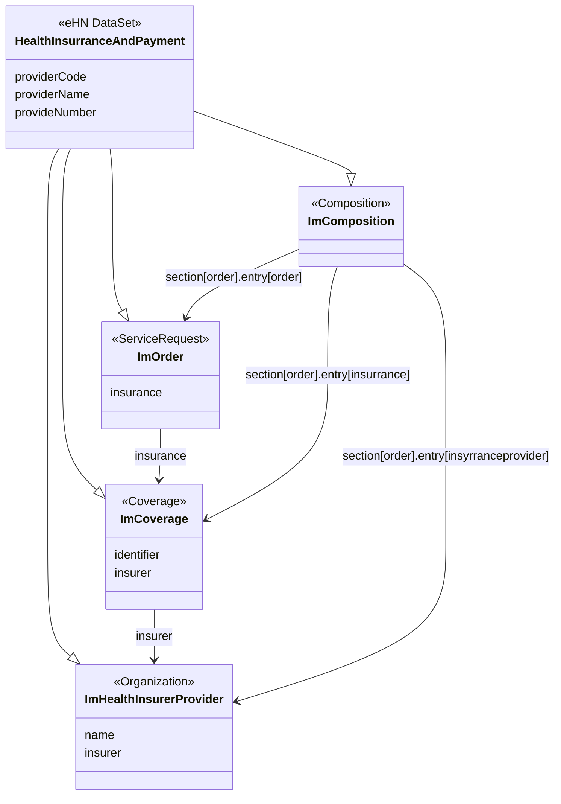

This concept map defines the mapping between the A.1.3. Health Insurance and Payment Information section and the FHIR profiles.

```mermaid
classDiagram
    class HealthInsurranceAndPayment{
        <<eHN DataSet>>
        providerCode
        providerName
        provideNumber
    }
    class ImCoverage{
        <<Coverage>>
        identifier
        insurer
    }
    class ImHealthInsurerProvider{
        <<Organization>>
        name
        insurer
    }
    class ImOrder{
        <<ServiceRequest>>
        insurance
    }
    class ImComposition{
        <<Composition>>
    }
    HealthInsurranceAndPayment --|> ImCoverage
    HealthInsurranceAndPayment --|> ImHealthInsurerProvider
    HealthInsurranceAndPayment --|> ImOrder
    HealthInsurranceAndPayment --|> ImComposition
    
    ImCoverage --> ImHealthInsurerProvider: insurer
    ImOrder --> ImCoverage: insurance
    ImComposition --> ImOrder: section[order].entry[order]
    ImComposition --> ImCoverage: section[order].entry[insurrance]
    ImComposition --> ImHealthInsurerProvider: section[order].entry[insyrranceprovider]

```

