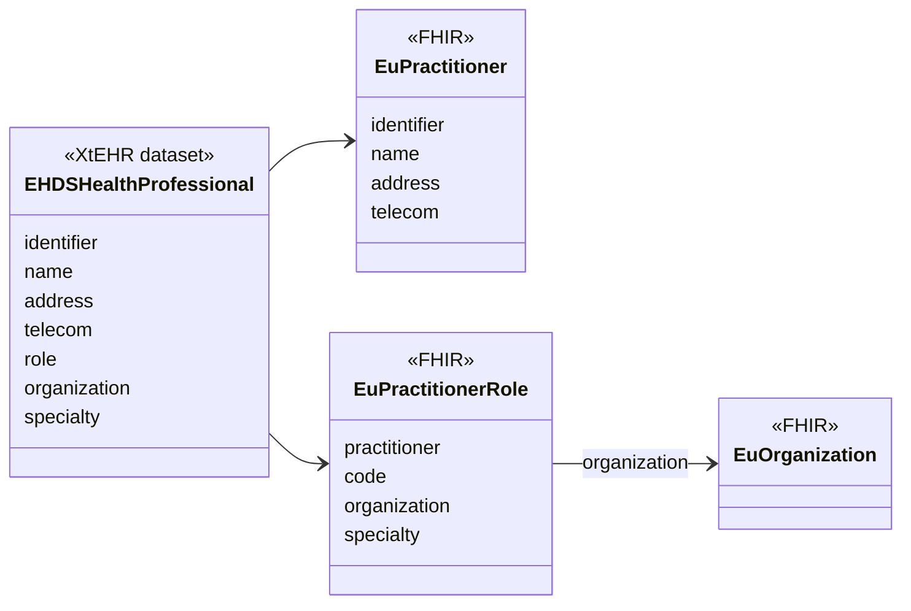



The figure below presents the {{XtEhrImaging}} DataSet representation and the FHIR profiles it maps to. For each FHIR profile the impacted fields are listed.

```mermaid
classDiagram
direction LR
class EHDSHealthProfessional {
  <<XtEHR dataset>>
  identifier
  name
  address
  telecom
  role
  organization
  specialty
}
link EHDSHealthProfessional "https://build.fhir.org/ig/Xt-EHR/xt-ehr-common/StructureDefinition-EHDSHealthProfessional.html"
class EuPractitioner{
  <<FHIR>>
  identifier
  name
  address
  telecom
}

class EuPractitionerRole{
  <<FHIR>>
  practitioner
  code
  organization
  specialty
}

class EuOrganization {
  <<FHIR>>
}
EHDSHealthProfessional --> EuPractitioner
EHDSHealthProfessional --> EuPractitionerRole
EuPractitionerRole --> EuOrganization : organization
```

