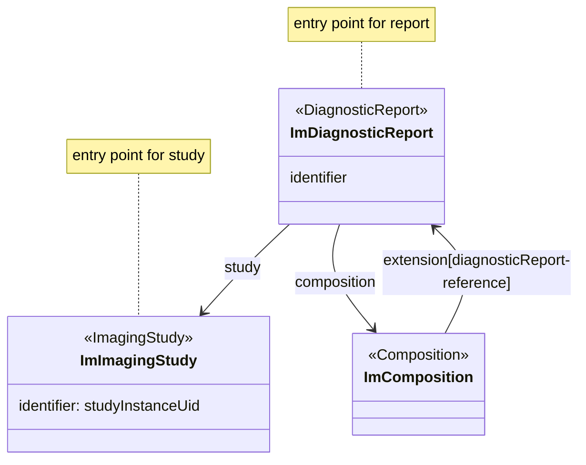

### Data entrypoints

This IG describes a large set of different resources. Using FHIR search operations, there are many different ways to search for specific information.

The goal of this IG is to provide information on Imaging Reports and Imaging Studies. Although it will allow for other ways to access information, the main "data entrypoints" are the resources that represent these resources.

Each imaging study is represented by a _single_ {{ImagingStudy}} resource.  
Each imaging report is represented by a {{DiagnosticReport}} resource. There might be more than one instance of the {{DiagnosticReport}}, when the status of the report changes. All of these will have the same `identifier`. The {{DiagnosticReport}} points a {{Composition}} resource that holds a structured representation of the contents of the report.

When modelling the IG, it is assumed that information related to the report will be gathered by starting at the {{DiagnosticReport}} and information related to the imaging study from the {{ImagingStudy}}.

All information related to the report will referred to from the {{Composition}}. All important structured information used for searching will be referred to from the {{DiagnosticReport}}. The structure of the {{Composition}} is subject to change and less formal on the meaning on referred to resources. When possible, such references will be made from the {{DiagnosticReport}}.
