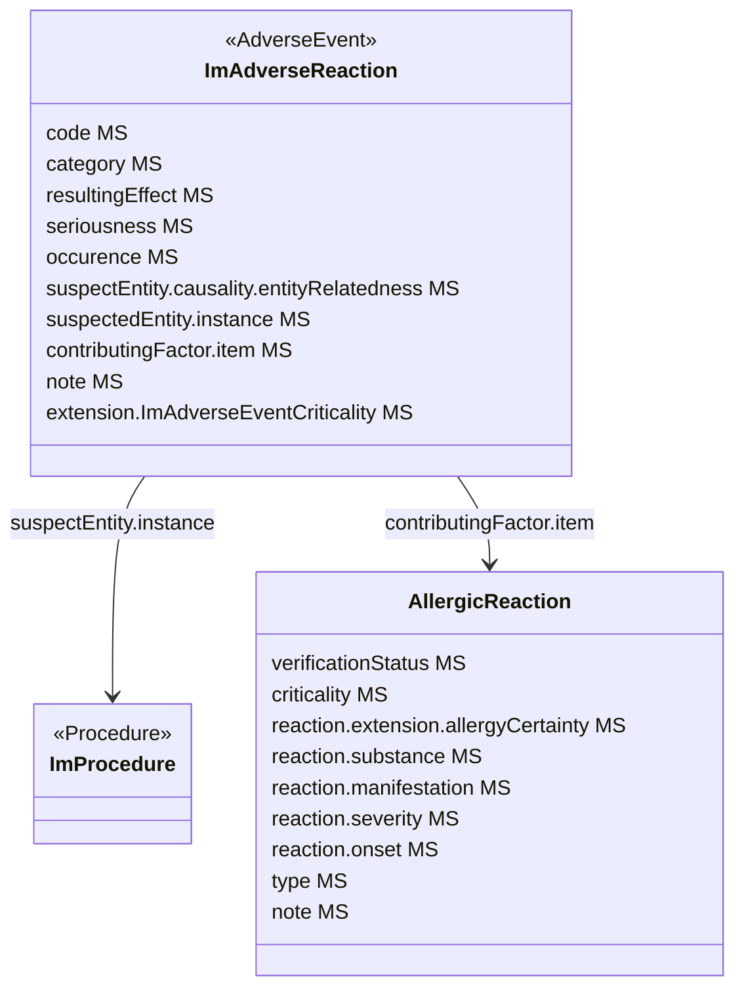

### Adverse reaction (Adverse reactions manifested during imaging investigation.)

Dataset A5.3 relates to the register of adverse events that occurred during or due to imaging procedures. This includes both allergy-caused reactions as well as non-allergic ones.

Three resource types can be used to encode the required data: `AdverseEvent`, `AllergyIntolerance`, and `Condition`.
In this IG, adverse reactions are recorded using the `AdverseEvent` resource. If the reaction is due to an allergy, it is also recorded using the `AllergyIntolerance` resource. Consumer systems will likely use this resource type to populate the allergy flags.

* Model

### Rationale and other choices for modeling

#### AdverseEvent resource

The decided modeling choice in this IG to represent an adverse reaction.

* Pros:
  * it can point to a Procedure. It represents widely both types of reactions (allergic and non-allergic).
  * It can point to an AllergyIntolerance resource, for the cases in which that pathogenic mechanisms is suspected or confirmed.
* Cons:
  * it lacks some of the allergy-specific elements required (i.e. `criticality`, `verification status`).
  * The resource focuses mainly is on the registration and monitoring of adverse events.
  * The link to the rest of the model is done through AdverseEvent.SuspectedEntity.ImProcedure, which is probably not the best way of referencing it, as it needs a reverse include to query adverse events happened in a given procedure.
  * A custom extension is required to encode the `criticality` data point.

#### AllergyIntolerance resource

The decided modeling choice in this IG to represent an allergic condition.

* Pros:
  * This resource provides off-the-shelf data elements to convey `severity`, `criticality`, `propensity` and a [standard extension](http://hl7.org/fhir/StructureDefinition/allergyintolerance-certainty) is available for the `certainty` element.
* Cons:
  * Although it has a `.reaction` element, the focus of the resource is on establishing allergic states, not on capturing events.
  * There is not a straightforward way to reference to or from a `Procedure` resource, so it can be linked to the main model. It could be achieved through `.encounter`, but that resource might not be exchanged in the Bundle, thus the reference would be lost.

#### Condition resource

* Pros:
  * It can be linked directly to a Procedure resource through `Procedure.complication`.
* Cons:
  * It encompasses all types of conditions, thus it defines too broadly the kind of event that this use case requires.
