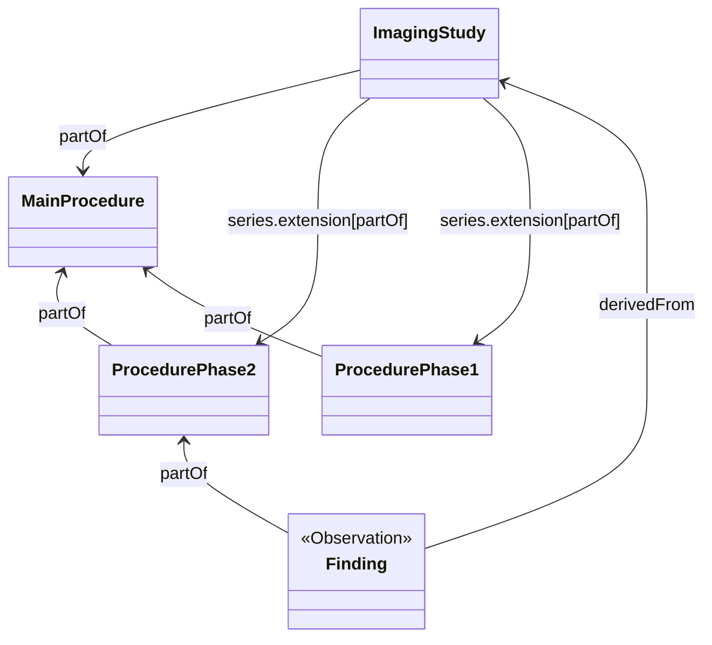

### Procedure Phases

The {{XtEhrImaging}} (requirement C.32.13.1 - Phase code) requires including of procedure phases. The description states: _"Study phase, e.g., without contrast, arterial phase, venous phase, delayed phase. Only some types of studies have phases."_

The imaging phase relates to certain studies such and radiation therapy and nuclear medicine. These procedures go through different phases, typically a phase represents a time frame after a tracer has been provided to the patient (e.g. [Abdominal CT: Urogram](https://litfl.com/abdominal-ct-urogram/)).

Just stating that the procedure included these phases does not seam to add a lot of value. The added value is linking results from the procedure to each stage.

These results include imaging series and instances and possibly findings.

#### Leave it in DICOM

Do not include this information in FHIR and the healthcare professional has to look at the DICOM image in order to detect the phase.

Findings (`Observations`) are linked to an `ImagingSelection` the phase is derived from the code.

#### Use child procedures

One way of modelling such a procedure would be to use child procedures.

Each phase/procedure step is represented by a separate Procedure. This is triggered by the stepped procedure information in DICOM. The results related to procedure step will be point to the sub-procedure.

An extension will be placed on `ImagingSystem.series` that indicates the series is partOf a sub-procedure.

Findings point to the sub-procedure representing the phase. This model introduces a large set of additional resource and references,including requirements on timing, not sure whether this is justified for this information.

#### Evaluation

Although the different options all make sense in some way. The last option has the smallest impact on the model and does not require additional extensions.

**CHOICE:** Procedure phases will be represented as `ImagingSelections`.