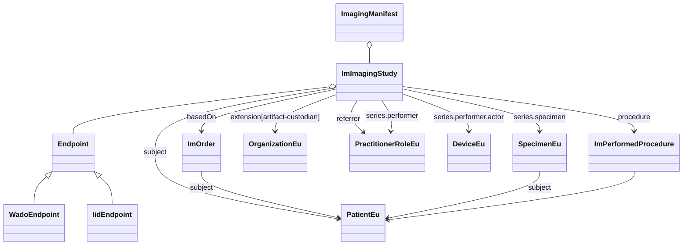

#### ImagingManifest design

The goal of this specification to provide access to imaging reports and imaging manifests.

The imaging reports represent the report made by the clinician based on the imaging study. The imaging manifest describes the details of the study and allows retrieval of the study data.

As reports are documents and need to be signed, it should not contain information that can change based on where it is hosted. The imaging manifest needs to provide access to the study data. The URL's used to retrieve this data are dependent on different aspects (proxy definitions, changes in storage location, ...) and cannot be assumed to be stable over time.

In FHIR the Endpoint resource is used to indicate endpoints that can be used to retrieve the study.

In order to protect the Imaging Report from such changes, the imaging endpoints are only required for Imaging Manifests.

**Decision:** Imaging Reports will not require endpoints, Imaging Manifests will.

Besides endpoint information, what other information needs to be included in the manifest? It should as a minimal contain all information needed to find it and support access of the study information.

The data in the manifest should correspond to the data that is present in the source DICOM data and should not extend beyond this. In this way it may differ from the corresponding information provided in the report (although that should be prevented).

If we exclude the radiation stuff. It includes only resources referred to from ImagingStudy.
