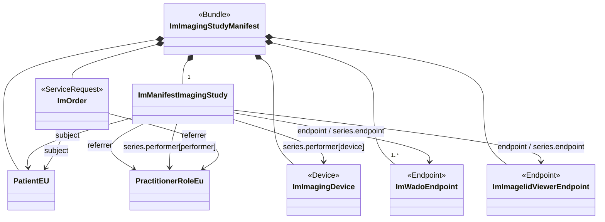

The imaging manifest represent a summary of the data stored in a DICOM imaging study. In document based deployments, it is the '*document*' that is searched for and provides the URL's that allow download of the imaging content. The figure below presents an overview of the data that is part of the imaging-manifest.

### Overview

The manifest is a FHIR bundle that includes the {{ImagingStudy}} resource and at least one {{Endpoint}}. The {{Endpoint}} resources contain the information that allows the client to access the DICOM data. The current model identifies two different {{Endpoint}}s. One that defines an {{DICOMwebWado}} which will allow download of the imaging data as well as extraction of thumbnails and retrieve the image data in other formasts (e.g. jpeg). The other endpoin defines the information to launch an {{iheIid}} based viewer.

Besides the {{ImagingStudy}} and {{Endpoint}} resources, it is also recommended to include additional resources that reflect information present in DICOM such as information on the patient, performer and imaging device.

The mapping from DICOM these resources is defined in the mapping sections of the resources.

### Structural Profiles

These define constraints on FHIR resources for systems conforming to this implementation guide.



