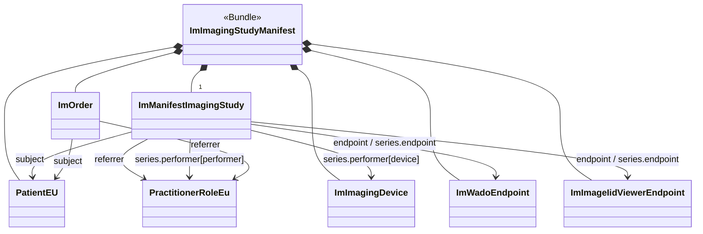

The imaging manifest represent a summary of the data stored in a DICOM imaging study. In document based deployments, it is the '*document*' that is searched for and provides the URL's that allow download of the imaging content. The figure below presents an overview of the data that is part of the imaging-manifest.

The mapping from DICOM these resources is defined in the mapping sections of the resources.

Structural Profiles
These define constraints on FHIR resources for systems conforming to this implementation guide.

{% sql { "query" : "SELECT name AS Name, title AS Title, Type, Description, Web, Url FROM Resources WHERE Type='StructureDefinition' AND Url NOT LIKE '%-provider' AND Url LIKE '%StructureDefinition/imm-%' ORDER BY Name", "class" : "lines", "columns" : [ { "name" : "Title" , "type" : "link" , "source" : "Title", "target" : "Web"}, { "name" : "Description", "type" : "markdown", "source" : "Description"} ] } %}
