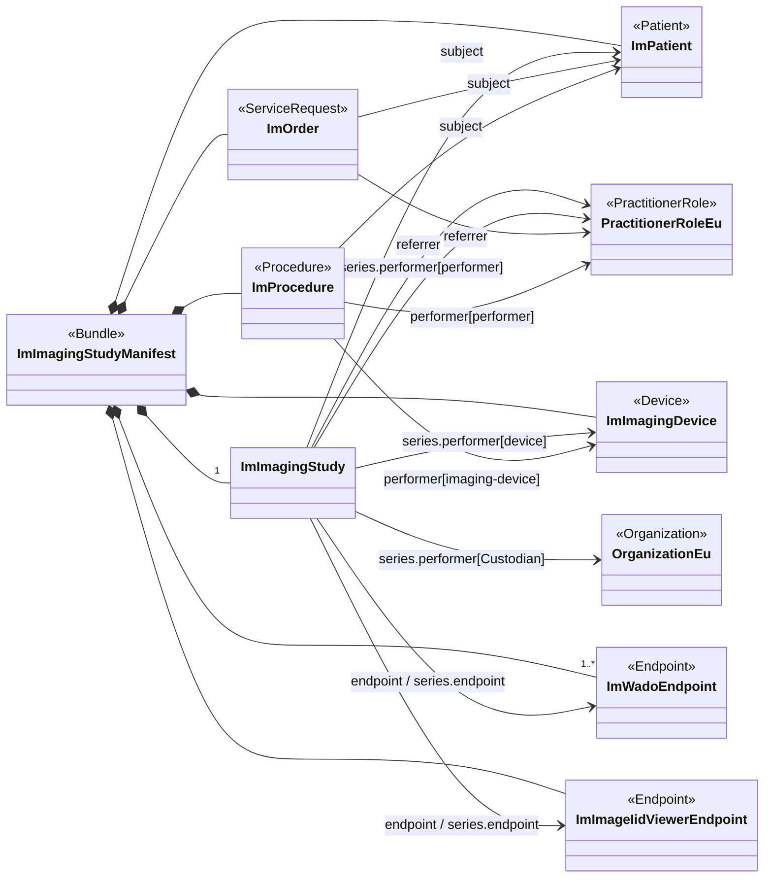


The imaging manifest represents a summary of the data stored in a DICOM imaging study. In document based deployments, it is the '*document*' that is searched for and provides the URL's that allow download of the imaging content. It is the data that is provided by a PACS system. The figure below presents an overview of the data that is part of the imaging-manifest.

In order to keep the diagram readable, not all references are included.

### Overview

The manifest is a FHIR bundle that includes the {{ImagingStudy}} resource and at least one {{Endpoint}}. The {{Endpoint}} resources contain the information that allows the client to access the DICOM data. The current model identifies two different {{Endpoint}}s. One that defines an {{DICOMwebWado}} which will allow download of the imaging data as well as extraction of thumbnails and retrieve the image data in other formats (e.g., jpeg). The other {{Endpoint}} defines the information needed to launch an {{iheIid}} based viewer.

Besides the {{ImagingStudy}} and {{Endpoint}} resources, it is also recommended to include additional resources that reflect information present in DICOM such as information on the patient, performer, procedure and imaging device.

The mapping from DICOM to these resources is defined in the mapping sections of the resources.

### Manifest Profiles

These profiles define constraints on FHIR resources for systems conforming to this implementation guide.

The imaging specific obligations are specified in:

{% sql {
  "query" : "SELECT name AS Name, title AS Title, Type, Description, Web FROM Resources WHERE Type='StructureDefinition' AND Name LIKE 'Manifest_Im%' ORDER BY CASE WHEN Name = 'Manifest_ImImagingStudyManifest' THEN 1 ELSE 2 END, Name ASC",
  "class" : "lines",
  "columns" : [
    { "name" : "Title"      , "type" : "link"     , "source" : "Name", "target" : "Web"},
    { "name" : "Name"       , "type" : "markdown" , "source" : "Title" },
    { "name" : "Description", "type" : "markdown" , "source" : "Description"}
  ]
} %}

The common obligations are specified in:

{% sql {
  "query" : "SELECT name AS Name, title AS Title, Type, Description, Web FROM Resources WHERE Type='StructureDefinition' AND Name LIKE 'Manifest_Eu%' ORDER BY Name",
  "class" : "lines",
  "columns" : [
    { "name" : "Title"      , "type" : "link"     , "source" : "Name", "target" : "Web"},
    { "name" : "Name"       , "type" : "markdown" , "source" : "Title" },
    { "name" : "Description", "type" : "markdown" , "source" : "Description"}
  ]
} %}
