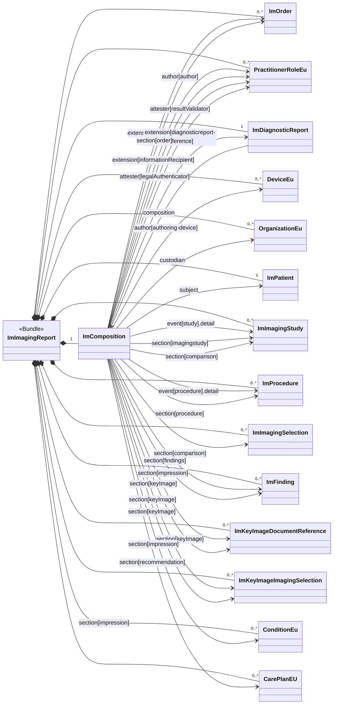


The imaging report represent a report made based on an ImagingStudy. In document based deployments. The figure below presents an overview of the data that is part of the imaging-report.

In order to keep the diagram readable, not all references are included 

### Overview

The manifest is a FHIR bundle that includes ImComposition and ImDiagnosticReport resources and all resources in tree of resources that referred to (see ($document)[https://www.hl7.org/fhir/composition-operation-document.html]).

### Report Profiles

These define obligations on FHIR resources for systems conforming to this implementation guide.

The imaging specific obligations are specified in:

{% sql {
  "query" : "SELECT name AS Name, title AS Title, Type, Description, Web FROM Resources WHERE Type='StructureDefinition' AND Name LIKE 'Report_Im%' ORDER BY Name",
  "class" : "lines",
  "columns" : [
    { "name" : "Title"      , "type" : "link"    , "source" : "Name", "target" : "Web"},
    { "name" : "Name"       , "type" : "link"    , "source" : "Title", "target" : "Web"},
    { "name" : "Description", "type" : "markdown", "source" : "Description"}
  ]
} %}

The common obligations are specified in:

{% sql {
  "query" : "SELECT name AS Name, title AS Title, Type, Description, Web FROM Resources WHERE Type='StructureDefinition' AND Name LIKE 'Report_Eu%' ORDER BY Name",
  "class" : "lines",
  "columns" : [
    { "name" : "Title"      , "type" : "link"    , "source" : "Name", "target" : "Web"},
    { "name" : "Name"       , "type" : "link"    , "source" : "Title", "target" : "Web"},
    { "name" : "Description", "type" : "markdown", "source" : "Description"}
  ]
} %}