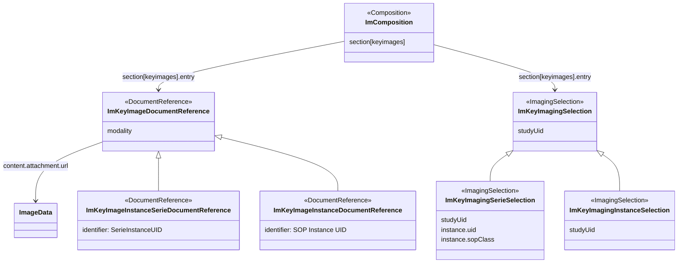

### Representation of Key Images

Key images can be represented in two ways:

* ImagingSelection
* DocumentReference

ImagingSelection if more DICOM oriented and only relates to DICOM identifiers. DocumentReference is more image oriented and also contains information on the size, duration, etc. aspects of the image.

The {{ehnImagingGuidelines}} requires information on the size, format, duration etc., data elements that are provided on the `Attachment` field on `DocumentReference`. If these fields are critical, DocumentReference fits more closely. In US Core the R4 `Media` resource is used to represent key images. This resource later merged into the FHIR R5 `DocumentReference`.

As this IG has an FHIR R5 and R4 representation, `DocumentReference` is an easy fit but in other sections of this specification, ImagingSelection is used (e.g. to state that an image can from a Procedure Phase).

The `ImagingSelection` resource points to a DICOM data. The DICOM instance data also holds the data required by the {{ehnImaging}}. So the client can retrieve the information from the DICOM source data.

The {{ehnImagingGuidelines}} also requires access to the imaging data. It refers to access the data directly or using an web based image viewer. A scenario that can be supported based on ImagingSelection as such mechanism require access to the DICOM identifiers and a WADO endpoint. Although not discussed yet, it is anticipated that a web based endpoint can operate based on similar data fields.

`DocumentReferences` refer to the data source directly (included in the Attachment or referred to it). It does not carry the DICOM identifiers, although these can be added to `DocumentReference` resources (identifier or extensions).

Another aspect, although unlikely, is that the report mey refer to key images (charts, pdf's, ...) not stored in a DICOM PACS, `DocumentReferences` would allow this.

There is a point to be made for both resource types.

**CHOICE:** Key images can be represented by `ImagingSelection` or `DocumentReference` resources.

**CHOICE:** When using `DocumentReference` to represent a DICOM data element, it will carry an identifier corresponding the serie or instance it represents.

That leaves the question in what way are these resources linked into the overall infrastructure.

